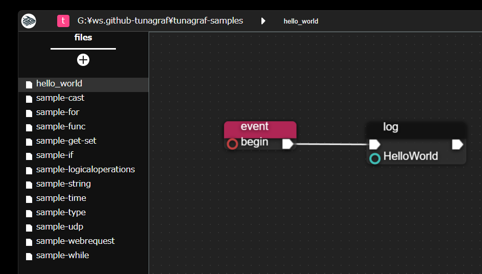

# tunagraf

---

> Note: オフィシャルWebサイトは https://tunagraf.mmzk.works/ です。

[tunagraf](https://tunagraf.mmzk.works/) はデスクトップOS向けのビジュアルプログラミングアプリです。
シンプルなノードを繋ぎ合わせることでプログラミングすることができます。

Electronで作られたアプリケーションで、ローカルPC上で利用することができます。
作成したプログラムは .tuna 形式で保存されます。
.tuna 形式は内部形式として JSON を採用しており、既存のプログラム言語のソースコード同様に Git 管理することができます。

# The tunagraf samples Repo

---

ここ (tunagraf sample repository)[] は tunagraf 向けのサンプルプログラムが見られるリポジトリです。
ここで配布されるのは tunagraf 向けの基本的な処理の書きかた例となります。
tunagraf 向けに実際にプログラムを作ってみたいけれどどう書くの？が分からない際などの参考情報としてお使いください。

## サンプルの使いかた

1. 本リポジトリをチェックアウトします。
2. PCに tunagraf をインストール、起動します。
3. tunagraf アプリ左上のワークスペース選択部をクリックして、チェックアウトしたリポジトリ・フォルダを選択します。
   1. 左側のワークスペースペインにプログラム一覧が表示されます。
      
   2. プログラムをクリックするとそのファイルが開かれ、中央部のキャンバスに表示されます。
   3. ウィンドウ上部中央の再生ボタンをクリックするか、キャンバスをクリックしてから ”R” キーを押すことでプログラムを実行できます。
4. これによりサンプルプログラムを選んで実行・試してみてください。

tunagraf 自体の使いかたは [Documents](https://tunagraf.mmzk.works/raw/document) を参照してください。